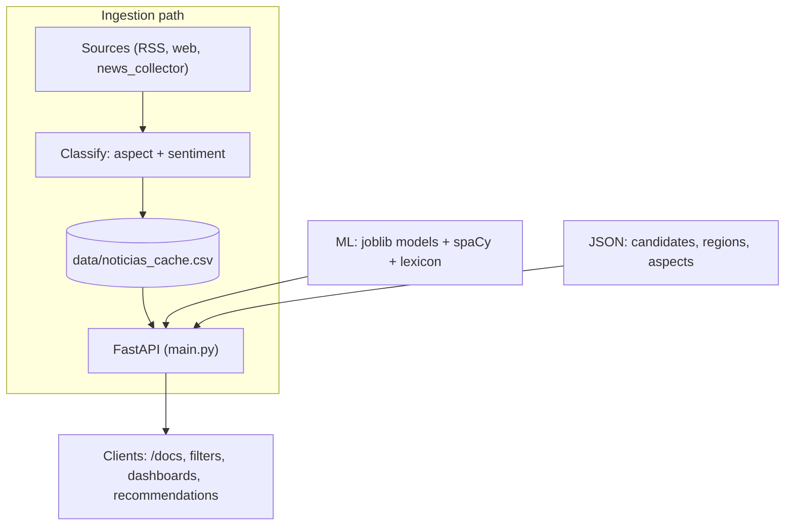

<!-- Canonical repository: https://github.com/sidnei-almeida/api_candidatos -->
<!-- Hero icons: Simple Icons via jsDelivr (HTTPS SVG); GitHub allows these in README img tags. -->
<p align="center">
  <a href="https://fastapi.tiangolo.com/" title="FastAPI"></a>
  &nbsp;&nbsp;
  <a href="https://www.python.org/" title="Python"></a>
  &nbsp;&nbsp;
  <a href="https://spacy.io/" title="spaCy"></a>
  &nbsp;&nbsp;
  <a href="https://scikit-learn.org/" title="scikit-learn"></a>
</p>

<h1 align="center">api_candidatos</h1>

<p align="center">
  <strong>A REST API (FastAPI) for collecting Brazilian political news, classifying aspect and sentiment with supervised models, and exposing metrics by candidate and region.</strong>
</p>

<p align="center">
  <a href="https://fastapi.tiangolo.com/"></a>
  <a href="https://www.python.org/downloads/"></a>
  
  
</p>

<p align="center">
  <a href="#overview">Overview</a> ·
  <a href="#gallery">Gallery</a> ·
  <a href="#features">Features</a> ·
  <a href="#requirements">Requirements</a> ·
  <a href="#installation-and-quick-start">Quick start</a> ·
  <a href="#api-reference">API</a> ·
  <a href="#examples">Examples</a> ·
  <a href="#project-layout">Layout</a> ·
  <a href="#troubleshooting">Troubleshooting</a> ·
  <a href="#author">Author</a>
</p>

---

## Overview

**api_candidatos** is a **FastAPI** service layer on top of an NLP core (`NoticiaService`): it loads **joblib** models for **aspect** and **sentiment**, optionally enriches predictions with **spaCy** (`pt_core_news_lg`), a political lexicon, and candidate/region lists. Articles are stored in a **CSV cache**; batch ingestion uses `news_collector` when available.

| Capability | Outcome |
|------------|---------|
| **Local / remote parity** | Models and data can live in the project tree or be fetched from public URLs (GitHub raw). |
| **Layered analysis** | Supervised models first; dictionary- and lexicon-based fallbacks when needed. |
| **Political focus** | Filters and aggregations by **candidate**, **region**, **aspect**, and **sentiment**; dashboards and recommendations. |

Interactive docs: once the server is up, open **`/docs`** (Swagger) or **`/redoc`**.

---

## Gallery

The diagram below summarizes the data flow: sources → classified ingestion → cached persistence → FastAPI, with the ML stack alongside. It uses **Mermaid**, which [GitHub renders natively](https://github.blog/changelog/2022-03-17-include-diagrams-markdown-files-mermaid/) in Markdown files (no image hosting required).



<p align="center">
  <em><strong>Figure 1.</strong> Conceptual API pipeline: ingestion and enrichment, storage in <code>data/noticias_cache.csv</code>, and REST consumption.</em>
</p>

---

## Features

| Area | Description |
|------|-------------|
| **News** | Listing with filters (`fonte`, date range), statistics, known sources, on-demand collection. |
| **Text analysis** | Aspect and sentiment by sentence; contextual analysis endpoint with entities and keywords when models and spaCy are active. |
| **Models** | `POST /modelos/prever`, `prever-aspecto`, `prever-sentimento`; `GET /modelos/info` for diagnostics. |
| **Candidates and regions** | Listings, aggregate analyses, regional topic map, comparative panel, and recommendations. |
| **CORS** | Permissive middleware for development (`*`); tighten origins in production. |

---

## Requirements

| Component | Notes |
|-----------|-------|
| **Python** | **3.10+** (aligned with `render.yaml` / `runtime.txt` when present). Virtual environment recommended. |
| **Dependencies** | See `requirements.txt` (FastAPI, uvicorn, pandas, scikit-learn, spaCy, etc.). |
| **spaCy** | **`pt_core_news_lg`** model (wheel in `requirements.txt` or `python -m spacy download pt_core_news_lg`). |
| **Large artifacts** | `modelo_aspectos.joblib` and `modelo_sentimentos.joblib` at the repo root *or* automatic download per `services.py`. |
| **Network** | Required when artifacts are fetched remotely or on first data load. |

---

## Installation and quick start

```bash
git clone https://github.com/sidnei-almeida/api_candidatos.git
cd api_candidatos
python -m venv venv
source venv/bin/activate   # Windows: venv\Scripts\activate
pip install -r requirements.txt
```

Run the entry script (downloads NLTK data when needed, checks spaCy, starts **uvicorn** with reload on **8000**):

```bash
python run.py
```

Equivalent to what **Render** / the **Procfile** use:

```bash
uvicorn main:app --host 0.0.0.0 --port 8000
```

The **`PORT`** environment variable is honored if you run `python main.py` directly (`os.environ.get("PORT", 8000)`).

Open **`http://localhost:8000/docs`** to exercise the endpoints.

---

## API reference

Main routes from `main.py` (groups and methods):

| Group | Endpoints (summary) |
|-------|---------------------|
| **Root** | `GET /` — API metadata and pointer to `/docs`. |
| **News** | `GET /noticias/`, `/noticias/analise`, `/noticias/coletar`, `/noticias/estatisticas`, `/noticias/fontes`, `/noticias/aspectos`, `/noticias/sentimentos`. |
| **Filters** | `GET /noticias/por-aspecto/{aspecto}`, `/por-sentimento/{sentimento}`, `/por-candidato/{candidato}`, `/por-regiao/{regiao}`. |
| **Text** | `POST /noticias/analisar-texto`, `POST /noticias/analise-contextual` — JSON body `{ "texto": "...", "preprocessar": true }`. |
| **Models** | `POST /modelos/prever`, `/modelos/prever-aspecto`, `/modelos/prever-sentimento`; `GET /modelos/info`. |
| **Candidates / region** | `GET /noticias/candidatos`, `/regioes`, `/noticias/candidato/{nome}/analise`, `/noticias/regiao/{regiao}/analise`. |
| **Dashboards** | `GET /noticias/mapa-temas-regionais`, `/noticias/painel-candidatos`, `/noticias/recomendacoes` (query params to narrow results). |

---

## Examples

Health check:

```bash
curl -s http://localhost:8000/ | jq
```

Trigger collection (runtime depends on sources):

```bash
curl -s http://localhost:8000/noticias/coletar | jq
```

Analyze text (JSON body):

```bash
curl -s -X POST http://localhost:8000/noticias/analisar-texto \
  -H "Content-Type: application/json" \
  -d '{"texto": "O governo anunciou medidas econômicas nesta semana."}' | jq
```

Predict with joblib models:

```bash
curl -s -X POST http://localhost:8000/modelos/prever \
  -H "Content-Type: application/json" \
  -d '{"texto": "Debatedores discutiram reforma no Congresso.", "preprocessar": true}' | jq
```

Smoke tests in this repository (from the project **root**):

```bash
python teste_simples.py
python test_api.py
```

---

## Project layout

```
.
├── main.py              # FastAPI app and routes
├── services.py          # NoticiaService: models, NLP, cache, aggregations
├── models.py            # Pydantic models
├── news_collector.py    # News ingestion (when available)
├── run.py               # Local entry: NLTK/spaCy resources + uvicorn
├── setup.py             # Environment setup (if present)
├── label_mappings.json
├── requirements.txt
├── runtime.txt
├── Procfile
├── render.yaml
├── data/                # Cache CSV, JSON (aspects, lexicon, candidates)
└── README.md
```

> **Note:** `.joblib` binaries and a populated `noticias_cache.csv` may be omitted from git due to size; the app tries to **load from disk** first and **download** configured assets from `services.py` when missing.

---

## Troubleshooting

| Symptom | What to check |
|---------|----------------|
| **Heavy `torch` / `transformers`** | Listed in `requirements.txt` for optional pipelines; if unused, consider a slimmer install or optional extras. |
| **spaCy fails to load** | Ensure `pt_core_news_lg` is installed; run `python -m spacy validate`. |
| **Models `None` on `/modelos/info`** | Place `.joblib` files at the root or verify connectivity to the configured download URLs. |
| **Empty cache** | Call `GET /noticias/coletar` and validate `news_collector`; without data, many `GET` routes return empty lists. |
| **422 on POST** | Send `Content-Type: application/json` and a body `{ "texto": "..." }` per `PredicaoRequest`. |

---

## Author

| | |
| --- | --- |
| **Maintainer** | [Sidnei Almeida](https://github.com/sidnei-almeida) |
| **Repository** | [github.com/sidnei-almeida/api_candidatos](https://github.com/sidnei-almeida/api_candidatos) |

---

## Additional documentation

For detailed run instructions, deploy notes, and diagnostics (Portuguese), see [`README_EXECUCAO.md`](README_EXECUCAO.md).

---

## Contributing

Issues and pull requests are welcome. When reporting bugs, include the Python version, relevant output from **`/modelos/info`**, and ideally the response of `GET /noticias/estatisticas`.

---

<p align="center">
  <sub>Text analysis in a political-news context; people or roles mentioned in examples are illustrative only.</sub>
</p>
